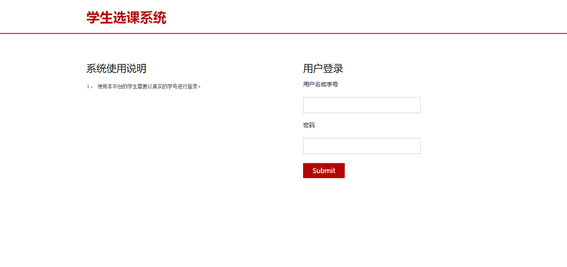
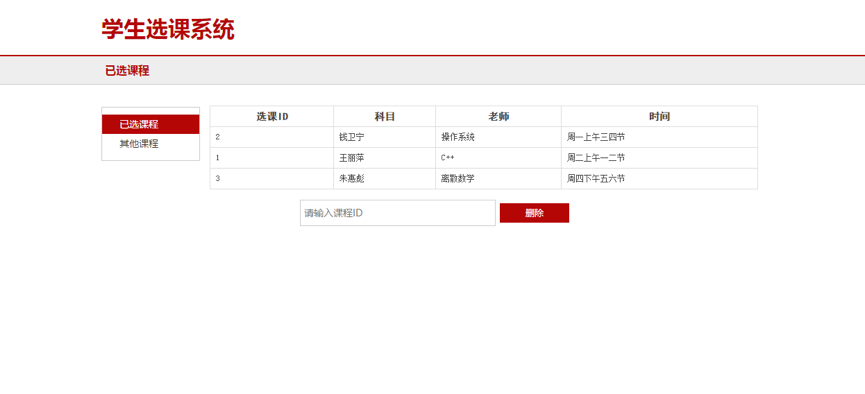
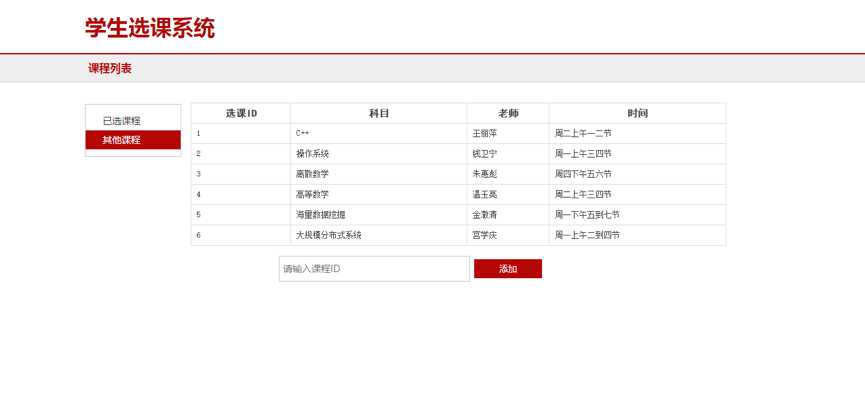

<head>基于Spring Cloud的分布式选课系统</head>

小组成员
郭姝男
51164500127叶方焱
51164500114 宋迦陵
51164500207 冯  琰

<h1>背景介绍</h1>
<h2>1.  项目范围</h2>
本项目是一个学生选课系统的demo，主要实现学生登录、学生选课、学生退课这几个功能。本项目不涉及管理员后台管理等界面，仅提供面向学生选课的界面。
应用场景主要是高校学生线上选课，方便学生网上自主选课，同时也方便教务对学生选课的管理工作。
<h2>2.  项目目标</h2>
旨在通过完成这个项目学习Spring Cloud框架、Spring Boot框架，以及Docker的使用，来实现微服务架构的分布式系统。
微服务与传统web开发方式相比，更适合实现敏捷开发和部署。基于微服务架构的分布式系统可以分成几个独立的模块，每个模块对应于一个服务，每个服务单独部署，为独立的业务开发，可以进行分布式的管理，开发效率更高。
</h2>3.  开发环境</h2>
Java JDK 1.8，Maven 3，Docker，MongoDB，html5

<h1>系统结构</h1>
本系统结构图如下图所示，主要分为Discovery service、Student service、Subject service、Web service。核心服务为Student service和Subject service。

Student Service
主要包含学生表和学生选的课程的表，表设计如下：
student{
id long（主键）,
name varchar(50),
password varchar(20)
}
ss{
id long（主键）,
stuid long,
subid long
}

Subject Service
主要包含全部课程的表，表设计如下：
subject{
id long（主键）,
name varchar(20),
teacher varchar(20),
time varchar(50)
}

Web Service
该服务主要为面向用户的服务，与针对student和subject的两个核心服务不同。这个服务主要用于接收来自用户的操作，与用户进行交互，实现用户与核心服务之间的友好互动。
该服务主要包含三个功能：
1.  用户登录：
用户在网页上输入学号和密码，web service需要通过查询student service数据库中相关表是否包括这条数据，并且验证其密码。验证通过，用户登录成功，显示已选课程页面，并可以进行对课程的添加和删除操作，反之，则登录失败，重新返回登录页面。
2.  删除课程：
用户登录成功之后，将进入已选课程页面，该页面会显示用户已经选的全部课程信息，用户可以通过输入课程id来对已选课程进行删除操作。在页面初始化操作中，web service通过用户登录时的学号查询student service数据库中的ss表中与用户相关的课程，并传回web service，从而实现页面显示所有该用户已选课程的功能。在用户输入课程id进行删除课程操作之后，后台控制器将调用student service从ss表中删除该用户和该课程对应的数据。
3.  增加课程：
用户可以通过页面左端导航栏跳转至其他课程页面，页面上将显示用户还未选的其他可选课程，用户可以通过输入课程id来进行选课操作。该页面同样实现了页面初始化操作，其初始化操作是通过web service的后台控制器调用subject service拿到其subject表中的全部课程数据，并与student service的ss表中该用户对应的stuid已选的课程数据进行比对，从而将未选课程数据返回页面。该页面中的增加课程功能则是在用户输入需要选择的课程id之后向student service的ss表中增加数据，并返回选课成功的结果。

Discovery Service
这是spring cloud项目中必需的一个服务，我们使用Eureka子项目来创建。
每个服务必须注册在它上面，服务之间通过这个discovery server来互相发现。

<h1>结果展示</h1>
登录页面

已选课程页面

其他课程页面

